# Ethos v1.6.3 UI Navigation Map

Skills file for agents driving the Ethos WASM emulator via Playwright.
Source: Ethos v1.6.3 User Manual rev 1 (FrSky X18/X20/X20S/X20 Pro/X20R/X20RS).

---

## Interaction Primitives

| Gesture / Key | Effect |
|---|---|
| Tap | Highlight / select item (first tap), or confirm selection |
| Double-tap | Open item for editing (some contexts) |
| Long-press on item | Open context popup (Edit / Add / Move / Clone / Delete) |
| Long-press on field value | Open "Options" popup (assign Var, invert, etc.) |
| Swipe left/right on menu grid | Navigate between menu pages (e.g. Model page 1 ↔ page 2) |
| Swipe up/down | Scroll lists |
| Rotary encoder rotate | Adjust highlighted numeric value |
| Rotary encoder press | Confirm / toggle |
| [RTN] | Back one level |
| [ENT] | Confirm / open |
| [PAGE] | Switch focus between UI panels |
| [MDL] | Jump to Model Setup tab |
| [DISP] | Jump to Configure Screens tab |
| [SYS] | Jump to System Setup tab |
| [ENT]+[PAGE] held 1 s | Lock/unlock touchscreen (from Home) |

**Popup pattern (lists):**
- First tap highlights the row (orange background)
- Second tap on the same row opens a context menu popup
- Popup options: **Edit**, **Add**, **Move**, **Clone**, **Delete** (available options vary)
- The `+` button in column headers also opens an Add dialog directly

**Field value entry:**
- Tap the value area to activate (turns orange)
- Rotate encoder or swipe to change value
- Tap again or press [ENT] to confirm

**Negative / inverse switch selector:**
- Long-press [ENT] on a switch name → "Negative" checkbox → toggles `!SwitchName`

---

## Confirmed Bitmap Coordinates

All coordinates are in 800×480 bitmap space. The WASM display canvas renders at 640×384 CSS
pixels at page y≈253.5. Conversion: `page_x = rect.x + bx*(rect.w/800)`.

Two interaction types: `tap` = `page.mouse.click()`, `touch` = `page.touchscreen.tap()`.
**`touch` requires `hasTouch: true` in the Playwright browser context** (must be set AFTER
`...devices['Desktop Chrome']` spread, which sets it to false).

Sources: `browser/tests/investigate/` specs with confirmed non-empty binary diffs,
plus screenshot evidence in `browser/findings/screenshots/`.

### Boot / startup dialogs

| Action | Coords | Type | Notes |
|--------|--------|------|-------|
| Dismiss "Select language" OK | (565, 297) | tap | |
| Dismiss "Radio data load: storage error" OK | (639, 292) | tap | |
| Dismiss "Checklist warning" OK | (700, 405) | tap | Appears once per session when tapping Model Setup if model has a checklist; dismisses to Home (not to Model Setup) ✓ confirmed 2026-05-02 |

### Bottom navigation bar (y=459 for all)

| Action | Coords | Type | Notes |
|--------|--------|------|-------|
| Home | (54, 459) | tap | |
| Model Setup | (194, 459) | tap | |
| Configure Screens | (334, 459) | tap | ✓ confirmed 2026-05-02 |
| System | (474, 459) | tap | ✓ confirmed 2026-05-02 |

### Global controls

| Action | Coords | Type | Notes |
|--------|--------|------|-------|
| Back arrow (← top-left) | (25, 25) | tap | Present on all sub-screens |

### Model Setup — Page 1 grid

Row 1 y≈140, Row 2 y≈330. Columns at x≈100, 300, 500, 700.

| Action | Coords | Type | Notes |
|--------|--------|------|-------|
| Edit Model | (300, 140) | tap | r1c2 |
| Flight Modes | (500, 140) | tap | r1c3 |
| Mixes | (700, 140) | tap | r1c4 |
| Outputs | (100, 330) | tap | r2c1 |
| Timers | (300, 330) | tap | r2c2 |
| Trims | (500, 330) | tap | r2c3 |
| RF System | (700, 330) | tap | r2c4 |
| Swipe to Page 2 | swipeCanvas('left') | swipe | distance≈400px, steps=20 |

### Model Setup — Page 2 grid (same x/y after swipe left)

| Action | Coords | Type | Notes |
|--------|--------|------|-------|
| Telemetry | (100, 140) | tap | r1c1 |
| Checklist | (300, 140) | tap | r1c2 ✓ confirmed 2026-05-02 |
| Logic Switches | (500, 140) | tap | r1c3 |
| Special Functions | (700, 140) | tap | r1c4 |
| Curves | (100, 330) | tap | r2c1 |
| Vars | (300, 330) | tap | r2c2 |
| Trainer | (500, 330) | tap | r2c3 ✓ confirmed 2026-05-02 |
| Lua | (700, 330) | tap | r2c4 — **absent in v1.6.6 X18RS** even with scripts installed; position reserved |

### System menu grid ✓ confirmed 2026-05-02

Reached via bottom nav x=474. Two pages (dot indicator at top).

**Page 1** (row 1 y≈140, row 2 y≈330, columns x≈100/300/500/700):

| Action | Coords | Type | Notes |
|--------|--------|------|-------|
| File manager | (100, 140) | tap | r1c1 — browse RADIO:/ SD card Flash |
| System alerts | (300, 140) | tap | r1c2 |
| Date & Time | (500, 140) | tap | r1c3 |
| General | (700, 140) | tap | r1c4 — language, keyboard, brightness, sleep |
| Battery | (100, 330) | tap | r2c1 |
| Hardware | (300, 330) | tap | r2c2 — sticks/pots/switches calibration |
| Sticks | (500, 330) | tap | r2c3 |
| Device config | (700, 330) | tap | r2c4 — sensors, servos, receivers, VTX, ESC |
| Swipe to Page 2 | swipeCanvas('left') | swipe | |

**Page 2** — only one tile:

| Action | Coords | Type | Notes |
|--------|--------|------|-------|
| Info | (100, 140) | tap | r1c1 — firmware version, serial numbers |

**File manager layout:**
- Left panel: scrollable file/folder list
- Right panel: preview/info area with tabs: **Radio** \| **SD card** \| **Flash**
- RADIO:/ filesystem contains: `[audio]`, `[models]`, `[scripts]` (after Lua upload), `radio.bin`

---

### Flight Modes screen

| Action | Coords | Type | Notes |
|--------|--------|------|-------|
| Add FM (+ header) | (569, 69) | tap | New FM editor auto-opens |
| Open FM1 editor via context menu | see sequence below | tap | 4-tap sequence; "Edit" is at same y as FM1 row |
| FM editor: Name field (opens keyboard) | (400, 85) | tap | Tapping anywhere in Name row activates field + opens keyboard |
| FM editor: Name pencil icon | (780, 80) | **touch** | Mouse events ignored for this icon |
| FM editor: Name pencil icon (alt) | (750, 83) | **touch** | Alternate confirmed position |
| Keyboard: key input | any | **touch** | `tapBitmap` registers wrong key — always use `touchBitmap` |
| Keyboard: ENTER | (700, 450) | **touch** | tapBitmap at y=415 had no effect; touchBitmap y=450 confirmed |
| Keyboard: Row 1 (QWERTYUIOP) | y=315 | — | Confirmed: y=335 last Row1 hit going down; y=315 = safe centre |
| Keyboard: Row 2 (ASDFGHJKL) | y=340 | — | Confirmed by typed D/F |
| Keyboard: Row 3 (ZXCVBNM) | y=395 | — | Confirmed: y=385 first Row3 hit |
| Keyboard: x-spacing | 80px per key | — | Confirmed from D(x=200) and F(x=280) in Row 2 |

**Keyboard x-positions (confirmed, 80px spacing):**

| x | Row 1 | Row 2 | Row 3 |
|---|-------|-------|-------|
| 40 | Q | A | (shift) |
| 120 | W | S | Z |
| 200 | E | D | X |
| 280 | R | F | C |
| 360 | T | G | V |
| 440 | Y | H | B |
| 520 | U | J | N |
| 600 | I | K | M |
| 680 | O | L | (backspace) |
| 760 | P | — | — |

**FM editor text field save pattern:**
After typing a name and pressing ENTER (keyboard closes, editor shows typed text):
1. Tap a different field in the FM editor (e.g. Active condition row at (400, 128)) — commits focus
2. `goBack` — exits FM editor to FM list
3. `goBack` again — exits FM list to Model Setup
4. Then download. A single `goBack` does **not** flush the name to the model binary.

**FM1 editor open sequence (confirmed 2026-05-01):**
```
tapBitmap(page, 400, 148)   // highlight FM0 row
tapBitmap(page, 400, 165)   // highlight FM1 row (FM0 popup dismissed)
tapBitmap(page, 400, 165)   // open FM1 context menu popup
tapBitmap(page, 400, 165)   // tap "Edit" (popup "Edit" sits at same y as FM1 row)
```
Result: FM1 editor opens directly. The context popup "Edit" item y-coord equals the FM1 row y-coord (165).

**⚠ Unresolved:**
- FM0 has an expanded touch area: taps at FM1's list row (y≈148) are intercepted by FM0 (hence the 4-tap workaround above)

### Outputs screen

**List layout** — 2-column grid, 4 rows, 8 channels per page.
Left column (x≈100–200) = odd channels; right column (x≈400–600) = even channels.
Page-dot indicator at y≈69; up to 8 pages (64 channels max in firmware).
This model (X18RS, 24 ch) shows 3 pages: CH1–8, CH9–16, CH17–24.

**Row y-coordinates** (consistent across all pages):
| Row | Approx y range | Confirmed tap y |
|-----|---------------|-----------------|
| 1 | y≈90–180 | y=112 (left) ✓, y=140 (right) ✓ |
| 2 | y≈185–265 | y=220 (right col CH4) ✓ |
| 3 | y≈270–385 | y=300 (right col CH6) ✓, y=350 (left col CH5) ✓ |
| 4 | y≈388–450 | y=390 (both cols CH7+CH8) ✓ |

| Action | Coords | Type | Notes |
|--------|--------|------|-------|
| Open CH1 editor (left col row 1) | (200, 112) | tap | ✓ confirmed 2026-05-03 |
| Open CH2 editor (right col row 1) | (600, 140) | tap | ✓ confirmed 2026-05-03 |
| Open CH3 editor (left col row 2) | (200, 220) | tap | estimated (same y as CH4) |
| Open CH4 editor (right col row 2) | (600, 220) | tap | ✓ confirmed 2026-05-03 |
| Open CH5 editor (left col row 3) | (200, 350) | tap | ✓ confirmed 2026-05-03 |
| Open CH6 editor (right col row 3) | (600, 300) | tap | ✓ confirmed 2026-05-03 |
| Open CH7 editor (left col row 4) | (200, 390) | tap | ✓ confirmed 2026-05-03 |
| Open CH8 editor (right col row 4) | (600, 390) | tap | ✓ confirmed 2026-05-03 |
| Swipe to next page (+8 channels) | swipeCanvas('left') | swipe | CH9–16 on page 2, CH17–24 on page 3 ✓ 2026-05-03 |
| Open CH9 editor (page 2, left row 1) | (200, 112) | tap | Same coords as CH1 ✓ confirmed 2026-05-03 |

**Channel editor fields** — field y-coords confirmed from tap sweep 2026-05-03:

| Field | Coords | Type | Notes |
|-------|--------|------|-------|
| Name | (600, ~150) | tap | Opens keyboard directly (tapBitmap works — unlike FM name) ✓ 2026-05-03 |
| Direction toggle (Normal↔Reverse) | (615, 250) | tap | Toggles between Normal/Reverse ✓ 2026-05-03 |
| Min | (600, 340) | tap | Opens numeric control bar ✓ 2026-05-03 |
| Max | (600, 380) | tap | Opens numeric control bar ✓ 2026-05-03 |
| Center/Subtrim | (600, 440) | tap | Opens numeric control bar; editor scrolls to show field ✓ 2026-05-03 |

**Control bar** (appears at y≈456 when numeric field is selected):

| Control | Coords | Type | Notes |
|---------|--------|------|-------|
| Step-down "<" | (44, 456) | tap | Decreases step size |
| Step label | (200, 456) | — | Shows current step (e.g. "0.1%") |
| Step-up ">" | (437, 456) | tap | Increases step size |
| Decrement "−" | (562, 456) | tap | Subtracts one step |
| Increment "+" | (675, 456) | tap | Adds one step |
| More "⋮" | (750, 456) | tap | Opens extended options |

### Mixes screen

**List layout** — scrollable rows grouped by output channel. Header shows Name | Channels | Source | [+].
New model comes pre-populated with default mixes (Ailerons/Elevators/Rudders). Right panel shows a curve graph + detail for the selected mix.

**To open a mix:** tap row once to select (orange highlight + right-panel preview), tap again to open context menu. Context menu items require `touchBitmap`.

| Action | Coords | Type | Notes |
|--------|--------|------|-------|
| + header button | (563, 69) | tap | Opens Mixes library grid (NOT a simple type picker) ✓ 2026-05-03 |
| Mixes library: Free mix | (100, 101) | tap | r1c1 of 4-col library grid; opens placement popup ✓ 2026-05-03 |
| Mixes library: Ailerons | (300, 101) | tap | r1c2 ✓ 2026-05-03 (visible in library screenshot) |
| Mixes library: Elevators | (500, 101) | tap | r1c3 ✓ 2026-05-03 |
| Mixes library: Rudders | (700, 101) | tap | r1c4 ✓ 2026-05-03 |
| Mixes library: Flaps (r2c1) | (100, 150) | tap | ✓ 2026-05-03 (visible in library screenshot) |
| Mixes library: Ail=>Rud (r2c2) | (300, 150) | tap | ✓ 2026-05-03 |
| Mixes library: Airbrake (r2c3) | (500, 150) | tap | ✓ 2026-05-03 |
| Mixes library: Butterfly (r2c4) | (700, 150) | tap | ✓ 2026-05-03 |
| Placement popup: First position | (320, 141) | **touch** | tapBitmap misses popup items; touchBitmap required ✓ 2026-05-03 |
| Placement popup: Last position | (320, 187) | **touch** | ✓ 2026-05-03 (tapBitmap(396,186) also worked when centred) |
| Placement popup: existing mix names | (320, 233+) | **touch** | Each ~46px below "Last position" |
| Mix row: select (1st tap) | (200, 116) | tap | "Free mix" row y≈116; highlights row, shows right-panel preview ✓ 2026-05-03 |
| Mix row: context menu (2nd tap) | (200, 116) | tap | Tap again on selected row → popup ✓ 2026-05-03 |
| Context menu: Edit | (350, 140) | **touch** | tapBitmap misses; touchBitmap required ✓ 2026-05-03 |
| Context menu: Add | (350, 187) | **touch** | opens new Free mix editor directly (same type as parent) ✓ 2026-05-03 |
| Context menu: Move | (350, 233) | **touch** | opens Mixes library (to replace/change mix type) ✓ 2026-05-03 |
| Context menu: Clone | (350, 279) | **touch** | duplicates mix in list ✓ 2026-05-03 |
| Context menu: Delete | (350, 340) | **touch** | opens "Are you sure you want to delete this mix?" confirm dialog ✓ 2026-05-03 (y=325 missed popup bottom; y=340 and y=350 both work) |
| Delete confirm: Yes | (520, 288) | tap | estimated from dialog layout |
| Delete confirm: No | (600, 288) | tap | estimated from dialog layout |

**Mix editor field layout** — left panel (x≈0–540), right panel = curve graph (x≈540–800). Use x=350 for all field taps.
Row spacing confirmed: Name@y=80, Active cond@y=140, Source@y=200, Operation@y=260 (each ~60px apart).

| Field | Coords | Type | Notes |
|-------|--------|------|-------|
| Name | (350, 80) | tap | Keyboard opens directly (no touch needed, unlike FM editor) ✓ 2026-05-03 |
| Active condition | (350, 140) | tap | Picker: Category / --- / Always on / Switch positions ✓ 2026-05-03 |
| Source | (350, 200) | tap | Compact category picker on 1st tap; full-screen list on 2nd tap; 2-col Category+Member on 3rd ✓ 2026-05-03 |
| Operation (multiplex) | (350, 260) | tap | Picker: Add / Multiply / Replace / Lock ✓ 2026-05-03 |
| Actions header | y≈305–350 | — | Inert separator label |
| Actions weight row (e.g. "Always on Weight 100%") | (350, 390) | tap | tap opens action row editor directly; row spans y≈390–465 ✓ 2026-05-03 |
| Action row context menu | wheel×5 + CDP Enter | special | "Action" popup: Edit / Clone / Add / Delete ✓ 2026-05-03 |
| Action ctx menu: Edit | (320, 150) | tap | ✓ 2026-05-03 |
| Action ctx menu: Clone | (320, 190) | tap | ✓ 2026-05-03 (estimated from spacing) |
| Action ctx menu: Add | (320, 230) | tap | adds new action row ✓ 2026-05-03 |
| Action ctx menu: Delete | (320, 270) | tap | ✓ 2026-05-03 (estimated from spacing) |
| + Add a new action | wheel×6 + CDP Enter | special | same as Vars; 6 wheels focuses button (orange), Enter opens new action editor ✓ 2026-05-03 |

**Action row editor** (opened by tapping "Always on Weight" row or via 6 wheels + Enter for new):
| Field | Coords | Type | Notes |
|-------|--------|------|-------|
| Active condition | (350, 95) | tap | picker: --- / Always on / Switch positions ✓ 2026-05-03 |
| Action (type) | (350, 135) | tap | picker: Weight / Offset / … ✓ 2026-05-03 |
| Weight / Rates | (350, 185) | tap | opens numeric control bar ✓ 2026-05-03 |
| + Add a new weight | (350, 230) | tap | adds per-condition weight entry ✓ 2026-05-03 |

**Source picker categories:** --- / Special / Analogs / Switches / Trims / Channels (scrollable)
**Source picker flow:** 1st tap = compact category list → 2nd tap = full-screen list → 3rd tap = 2-col Category+Member view

### Vars screen

| Action | Coords | Type | Notes |
|--------|--------|------|-------|
| Add var (+ on empty screen) | (400, 266) | tap | Large centered + icon; editor opens directly ✓ confirmed 2026-05-01 |
| Add var (+ in list header, once ≥1 exist) | (563, 69) | tap | Opens new Var editor directly ✓ confirmed 2026-05-02 |
| Var list: tap row to highlight | (200, 106) | tap | Var1 row approximate y; second tap opens context menu (estimated) |

**Var editor field layout** — all y-coords in bitmap space (800×480).
Rule: upper fields (Comment and above) use **tap**; lower fields (Range and below) use **touch**.

| Field | Coords | Type | Notes |
|--------|--------|------|-------|
| Value (read-only) | (600, 70) | — | No response to tap or touch |
| Name | n/a | — | **Non-interactive in WASM.** Extensive testing (tap+touch, x=400–780, y=90–115, double-tap) all produced no response. May be a WASM emulator limitation. |
| Comment text area | (600, 267) | **tap** | Opens keyboard ✓ confirmed 2026-05-01; area spans y≈220–295 |
| Range low value (-100.0%) | (450, 320) | **touch** | Opens numeric control bar ✓ confirmed 2026-05-01; tapBitmap has no effect; spans y≈310–340 |
| Range high value (100.0%) | (640, 320) | **touch** | Opens numeric control bar ✓ confirmed 2026-05-01; x=590 still hit low value; x=640 hits high value |
| Values default value (0.0%) | (600, 395) | **touch** | Opens numeric control bar ✓ confirmed 2026-05-01; tapBitmap has no effect; spans y≈380–425 |
| "+ Add a new value" button | (600, 440) | **touch** | Adds conditional value entry ✓ confirmed 2026-05-01; tapBitmap has no effect; spans y≈435–455 |

**"+ Add a new value" result:** Adds a new conditional value row at the bottom of the editor:
`[🗑 delete] [--- ▼ condition] [0.0% value]`
- Delete button: bx≈25, y≈460 — `tapBitmap` opens "remove this value?" confirm dialog (estimated, same pattern as action row)
- Condition dropdown (`--- ▼`): `tapBitmap(200, 430)` opens Category picker (System event / --- / Always on / switches) ✓ 2026-05-02
- Value (0.0%): right side of row, `tapBitmap` opens numeric control bar (estimated, same as default value field)

**Control bar layout** (appears at bottom of screen, y≈440–480, when a touch-activated numeric field is active):

| Button | Bitmap x (approx) | Notes |
|--------|------------|-------|
| `<` step down | ~50 | Decreases step size |
| step size display | ~200 | Shows current step (e.g. 0.1%) |
| `>` step up | ~350 | Increases step size |
| `−` decrement | ~470 | Decreases value by one step |
| `+` increment | ~620 | Increases value by one step |
| `⋮` more options | ~760 | Opens options popup (e.g. assign Var) |

**Scrolling the Var editor — confirmed approach (2026-05-01):**

Use a CDP touch swipe sequence (touchStart + touchMove × 20 + touchEnd) from bitmap y=440→150 to scroll the content and reveal the Actions section. This is better than mouse drag scroll, which corrupts subsequent touch events.

After CDP touch swipe, touch events remain fully functional — confirmed:
| Field | y (scrolled, bitmap) | Type | Status |
|-------|---------------------|------|--------|
| Comment text area | y≈130–180 (center ~155) | **touch** (keyboard opens) | ✓ confirmed 2026-05-01 |
| Range low value | y≈185–250 (center ~220) | **touch** (control bar) | ✓ confirmed 2026-05-01 |
| Values 0.0% | y≈270–315 (center ~290) | **touch** (control bar) | ✓ confirmed 2026-05-01 |
| "+ Add a new value" | y≈320–365 (center ~340) | **touch** | ✓ reachable post-scroll |
| Actions header | y≈365–400 | — | inert |
| "+ Add a new action" | wheel×7 then CDP Enter | special | ✓ confirmed 2026-05-02 — see below |

**"+ Add a new action" — activation method (confirmed 2026-05-02):**

The button renders at y≈452–479 (very bottom edge of canvas). Neither `tapBitmap` nor `touchBitmap` at any y from 380–480 activate it (tested exhaustively). It requires encoder-style focus + confirm:

```typescript
// 1. Open the Var editor (tapBitmap 400,266)
// 2. Wheel to focus the button (7 × deltaY=300)
const centre = await bitmapToPage(page, 400, 300);
const client = await page.context().newCDPSession(page);
for (let i = 0; i < 7; i++) {
  await client.send('Input.dispatchMouseEvent', {
    type: 'mouseWheel', x: centre.x, y: centre.y,
    deltaX: 0, deltaY: 300, modifiers: 0, pointerType: 'mouse',
  });
  await page.waitForTimeout(150);
}
await page.waitForTimeout(400);
// Button is now orange-highlighted (focused)

// 3. Activate via CDP key dispatch (NOT page.keyboard.press — canvas lacks DOM focus)
await client.send('Input.dispatchKeyEvent', {
  type: 'keyDown', windowsVirtualKeyCode: 13,
  key: 'Enter', code: 'Enter', nativeVirtualKeyCode: 13,
});
await page.waitForTimeout(80);
await client.send('Input.dispatchKeyEvent', {
  type: 'keyUp', windowsVirtualKeyCode: 13,
  key: 'Enter', code: 'Enter', nativeVirtualKeyCode: 13,
});
```

Why `page.keyboard.press('Enter')` fails: the WASM canvas has no DOM keyboard focus, so keydown events go to `document.body` and are ignored by the WASM. CDP `Input.dispatchKeyEvent` bypasses DOM focus and reaches the WASM directly.

**After activation:** A new action row appears inline in the Actions list:
`[🗑] [--- ▼] [Add(+) ▼] [■■■] [0.0]`
- 🗑 — **delete button** (bx≈25, y≈465): `tapBitmap` opens "Are you sure you want to remove this action?" confirm dialog ✓ 2026-05-02
- `--- ▼` — condition/switch picker (bx≈150, y≈465): `tapBitmap` opens Category picker (System event / --- / Always on / switches below scroll) ✓ 2026-05-02
- `Add(+) ▼` — action type / function picker (bx≈290, y≈465): `tapBitmap` opens Function picker ✓ 2026-05-02
- Orange bar — range indicator (bx≈420) — inert/display only
- `0.0` — value field; `tapBitmap(600, ~465)` opens numeric control bar ✓ 2026-05-02

**Action row Function picker** (opens from bx=290 tap; title "Function") ✓ fully confirmed 2026-05-02:

Full item list (9 total): **Assign(=) · Add(+) · Subtract(-) · Multiply(*) · Divide(/) · Percent · Min · Max · Repurpose**

Picker shows 5 items at a time. Item heights ≈40px each. Visible y-positions (bitmap) are always:

| Slot | y (center) | After 0 scrolls | After 1 scroll | After 2 scrolls |
|------|-----------|-----------------|----------------|-----------------|
| 1 | ≈140 | Assign(=) | Multiply(*) | Divide(/) |
| 2 | ≈180 | Add(+) ← default | Divide(/) | Percent |
| 3 | ≈218 | Subtract(-) | Percent | Min |
| 4 | ≈252 | Multiply(*) | Min | Max |
| 5 | ≈288 | Divide(/) | Max | Repurpose |

**Scrolling the picker:** use CDP touch swipe UPWARD inside the picker (byStart=280 → byEnd=140, bx=320):
```typescript
await touchSwipeInPicker(page, 320, 280, 140);  // one scroll = reveals rows 4–8
await touchSwipeInPicker(page, 320, 280, 140);  // two scrolls = reveals rows 5–9 (Repurpose visible)
```
Mouse drag dismisses the picker — must use CDP `Input.dispatchTouchEvent` (touchStart/Move/End).

To select an item: `tapBitmap(page, 400, <slot_y>)` after scrolling to the desired position.

**Action row condition picker** (opens from bx=150 tap; title "Category"):
Same picker as LS/SF Active condition — items: System event / --- / Always on / switch positions (scroll to reach). Selecting an item closes the picker and updates the `--- ▼` field.

**User workaround:** Click canvas to give it DOM focus, then press physical Enter on keyboard — equivalent effect to CDP dispatch.

### Special Functions screen

| Action | Coords | Type | Notes |
|--------|--------|------|-------|
| Add SF (+ on empty screen) | (400, 266) | tap | Large centered + icon; editor opens directly ✓ confirmed 2026-05-01 |
| SF editor: Action field | (600, 100) | tap | Opens action type picker ✓ confirmed 2026-05-01 |
| SF editor: State toggle | (600, 160) | tap | Toggles Disable↔Enable ✓ confirmed 2026-05-01 |
| SF editor: Active condition field | (600, 220) | tap | Opens condition picker (---, Always on, Switch positions) ✓ confirmed 2026-05-01 |
| SF editor: Global toggle | (600, 280) | tap | Toggles OFF↔ON ✓ confirmed 2026-05-01 |
| SF editor: Reset param field | (600, 340) | tap | Opens reset category picker (Timers / Flight data / …) ✓ confirmed 2026-05-01 |

**SF editor field y-ranges (bitmap, confirmed from tap sweep 2026-05-01):**
- Action: y≈70–130 (center ~100) — opens action type picker
- State: y≈130–195 (center ~160) — Disable/Enable toggle
- Active condition: y≈200–255 (center ~220) — opens condition picker
- Global: y≈260–315 (center ~280) — OFF/ON toggle
- Action-specific param (e.g. Reset): y≈320–380 (center ~340)

**SF Action picker** (opens from Action field at (600, 100); item y-coords in picker):

Item positions in the picker overlay window are fixed at y = 170, 210, 250, 290, 330 (40 px spacing).
Picker shows 5 items at a time; Play vario (item 10, last) sits at the bottom edge (y≈330) and its
tap area is clipped — select it via wheel focus + CDP Enter instead (see scroll recipe below).

| Action type | Picker item y | Confirmed | Action-specific fields added |
|-------------|---------------|-----------|------------------------------|
| Reset | 170 | ✓ 2026-05-01 | "Reset" category (Timers / Flight data) at editor y≈340 |
| Screenshot | 210 | ✓ 2026-05-01 | none |
| Set failsafe | 250 | ✓ 2026-05-01 | "Module" field |
| Play audio | 290 | ✓ 2026-05-02 | Voice, Repeat fields |
| Haptic | 210 after 1 swipe | ✓ 2026-05-02 | Pattern, Strength fields |
| Write logs | 250 after 1 swipe | ✓ 2026-05-02 | Write interval, Sticks/Pots/Sliders fields |
| Go to screen | 210 after 2 swipes | ✓ 2026-05-02 | Screen picker field |
| Lock touchscreen | 250 after 2 swipes | ✓ 2026-05-02 | none |
| Load model | 290 after 2 swipes | ✓ 2026-05-02 | Model picker, Confirmation fields |
| Play vario | wheel focus + Enter | ✓ 2026-05-02 | Source field |

**Note:** "Play text" does NOT appear in the picker — absent in this firmware version.

**Picker scroll recipe** (CDP touch swipe — mouse drag dismisses the overlay):
```ts
// One swipe: finger moves UP (byFrom=290 → byTo=130), shifts list ~3 items forward
await touchSwipeBitmap(page, 350, 290, 130);
// After 1 swipe: Play audio(170) Haptic(210) Write logs(250) Lock touchscreen(290)
// After 2 swipes: Write logs(170) Go to screen(210) Lock touchscreen(250) Load model(290) Play vario(330)
```

**Selecting Play vario** (bottom item, tap area clipped at picker boundary):
```ts
// 2 swipes to reach the bottom of the list, then wheel focus + CDP Enter
await touchSwipeBitmap(page, 350, 290, 130);
await touchSwipeBitmap(page, 350, 290, 130);
// Negative wheel delta focuses Play vario (highlights it orange)
await wheelAt(page, 350, 250, -300);   // deltaY=-300 moves focus DOWN to last item
await cdpEnter(page);                   // confirms the focused item → Play vario selected
```

### Logic Switches screen

| Action | Coords | Type | Notes |
|--------|--------|------|-------|
| Add LS (+ on empty screen) | (400, 266) | tap | Large centered + icon; editor opens directly ✓ confirmed 2026-05-01 |
| LS editor: Name field | (600, 120) | tap | Keyboard opens directly (no touch needed) ✓ confirmed 2026-05-01 |
| LS editor: Function field (value side) | (600, 160) | tap | Opens function picker ✓ confirmed 2026-05-01 |
| LS editor: Source(A) field | (600, 215) | tap | Opens Category/Member source picker ✓ confirmed 2026-05-01 |
| LS editor: Value(X) field | (600, 280) | tap | Opens numeric control bar ✓ confirmed 2026-05-01 |
| LS editor: Active condition field | (600, 360) | tap | Opens condition picker (System event / Always on / Switch positions) ✓ confirmed 2026-05-01 |

**LS editor field y-ranges (bitmap, confirmed from tap sweep 2026-05-01/03):**
- Name: y≈90–130 (center ~120)
- Function: y≈130–190 (center ~160)
- Source(A): y≈195–245 (center ~215)
- Value(X): y≈255–310 (center ~280)
- Active condition: y≈340–390 (center ~360)

**Scrolled fields** — require 1× CDP touch swipe (bx=400, byStart=440, byEnd=150) to reach.
After scroll, y-positions in bitmap space:
- Delay before active: y≈70–115 (center ~100) — tap, numeric control bar (0.1s step) ✓ 2026-05-03
- Delay before inactive: y≈120–165 (center ~180) — tap, numeric control bar (0.1s step) ✓ 2026-05-03
- Confirmation before active: y≈215–255 (center ~220) — tap toggle (full-row; no control bar) ✓ 2026-05-03
- Confirmation before inactive: y≈260–300 (center ~260) — tap toggle ✓ 2026-05-03
- Min duration: y≈360–405 (center ~380) — tap, numeric control bar (0.1s step) ✓ 2026-05-03
- Max duration: y≈410–450 (center ~420) — tap, numeric control bar (0.1s step) ✓ 2026-05-03
- Comment: visible at y≈460+ after 1 scroll / y≈340 after 2 scrolls — likely touchBitmap (pencil icon); not yet confirmed

**⚠ Dismiss-tap warning:** after interacting with a scrolled field, dismiss by tapping a neutral area
such as (400, 50) or using `goBack`. Do NOT dismiss at y≈220–260 — those rows are toggle fields
and will inadvertently flip their state.

**LS editor full field list** (12 fields total):
1. Name — y≈120 (unscrolled)
2. Function — y≈160 (unscrolled)
3. Source(A) — y≈215 (unscrolled)
4. Value(X) — y≈280 (unscrolled)
5. Active condition — y≈360 (unscrolled)
6. Delay before active — y≈100 (after 1 scroll) ✓ 2026-05-03
7. Delay before inactive — y≈180 (after 1 scroll) ✓ 2026-05-03
8. Confirmation before active — y≈220 (after 1 scroll), toggle ✓ 2026-05-03
9. Confirmation before inactive — y≈260 (after 1 scroll), toggle ✓ 2026-05-03
10. Min duration — y≈380 (after 1 scroll) ✓ 2026-05-03
11. Max duration — y≈420 (after 1 scroll) ✓ 2026-05-03
12. Comment — y≈460 (after 1 scroll) / y≈340 (after 2 scrolls) — touchBitmap; unconfirmed

**LS Function picker** (opens from Function field at (600, 160), scrollable list):
- Items visible without scrolling: A~X · A=X · A>X · A<X · |A|>X
- Items below scroll: |A|<X · Δ>X · |Δ|>X · Range · AND · OR · XOR · Timer gen · Sticky · Edge
- Picker item height ≈ 40 bitmap px; first item (A~X) at picker y≈130-170
- To scroll picker: must use touch swipe inside the picker overlay (mouse drag dismisses picker)
- Confirmed: tap (350, 170) selects A~X ✓ 2026-05-01

---

## Menu Tree (Mermaid)

```mermaid
graph TD
  ROOT([Ethos Home Screen])

  ROOT --> NAVBAR

  subgraph NAVBAR["Bottom Navigation Bar"]
    HOME["🏠 Home\n[HOME]"]
    MODEL["✈ Model Setup\n[MDL]"]
    DISP["🖥 Configure Screens\n[DISP]"]
    SYS["⚙ System Setup\n[SYS]"]
  end

  %% ── MODEL SETUP ──────────────────────────────────────────────
  MODEL --> MP1["Model Setup – Page 1\n(swipe right for page 2)"]
  MODEL --> MP2["Model Setup – Page 2\n(swipe left from page 1)"]

  MP1 --> MSEL["Model Select\n(model list)"]
  MP1 --> MEDIT["Edit Model\n(name/image/type)"]
  MP1 --> FM["Flight Modes\nFM0–FM8"]
  MP1 --> MIX["Mixes\n(mix list)"]
  MP1 --> OUT["Outputs\nCH1–CH32"]
  MP1 --> TMR["Timers\nT1–T2"]
  MP1 --> TRIM["Trims"]
  MP1 --> RF["RF System\n(internal/external)"]

  MP2 --> TELEM["Telemetry"]
  MP2 --> CHECK["Checklist"]
  MP2 --> LS["Logic Switches\nLS1–LS64"]
  MP2 --> SF["Special Functions\n(SF list)"]
  MP2 --> CURVE["Curves\n(up to 50)"]
  MP2 --> VARS["Vars\n(up to 64)"]
  MP2 --> TRAIN["Trainer"]

  %% Model Select sub-tree
  MSEL --> MSEL_CTX["Context menu:\nEdit / Select / Add\nMove / Clone / Delete"]

  %% Edit Model
  MEDIT --> MEDIT_FIELDS["Name | Image | Model type\nThrottle warning | Switch warnings"]

  %% Flight Modes
  FM --> FM_ITEM["FM detail\n(Name / Switch / Fade in / Fade out)"]

  %% Mixes
  MIX --> MIX_CTX["Context: Edit/Add/Move/Clone/Delete"]
  MIX --> MIX_DETAIL["Mix detail screen"]
  MIX_DETAIL --> MIX_FIELDS["Name | Source | Target\nWeight | Offset | Switch\nCurve | Modes | Multiplex"]
  MIX_DETAIL --> MIX_SPEED["Speed settings\n(Slow up / Slow down)"]
  MIX_DETAIL --> MIX_TRIM["Trim usage\n(include/exclude)"]

  %% Outputs
  OUT --> OUT_DETAIL["Output detail screen"]
  OUT_DETAIL --> OUT_FIELDS["Name | Direction | Min | Max\nSubtrim | PWM centre\nCurve | Slow | Balance | Swap"]

  %% Timers
  TMR --> TMR_DETAIL["Timer detail\n(Countdown / Count-up)"]
  TMR_DETAIL --> TMR_FIELDS["Name | Mode | Start value\nSource | Switch | Persistence\nAudio actions"]

  %% Trims
  TRIM --> TRIM_MODES["Mode: Easy / Independent / Custom / OFF"]
  TRIM --> TRIM_CROSS["Cross trim toggle"]
  TRIM --> TRIM_INST["Instant trim"]
  TRIM --> TRIM_SUB["Move to subtrims"]

  %% RF System
  RF --> RF_INT["Internal module\n(ACCESS / ACCST / TD)"]
  RF --> RF_EXT["External module"]

  %% Logic Switches
  LS --> LS_CTX["Context: Edit/Add/Move/Clone/Delete"]
  LS --> LS_DETAIL["LS detail screen"]
  LS_DETAIL --> LS_FUNC["Function picker\n(A~X A=X A>X A<X\n|A|>X |A|<X Δ>X |Δ|>X\nRange AND OR XOR\nTimer gen Sticky Edge)"]
  LS_DETAIL --> LS_PARAMS["Duration | Delay\nA/B operands (context-specific)"]

  %% Special Functions
  SF --> SF_CTX["Context: Edit/Add/Move/Clone/Delete"]
  SF --> SF_DETAIL["SF detail screen"]
  SF_DETAIL --> SF_CMN["Common: State | Active condition | Global"]
  SF_DETAIL --> SF_RESET["Action: Reset\n(Flight data / All timers / Whole telemetry)"]
  SF_DETAIL --> SF_SCRN["Action: Screenshot"]
  SF_DETAIL --> SF_FSAFE["Action: Set failsafe\n(Module selector)"]
  SF_DETAIL --> SF_AUDIO["Action: Play audio\n(Voice/Repeat/Skip on startup/Sequence)"]
  SF_DETAIL --> SF_HAPTIC["Action: Haptic\n(Pattern/Strength/Repeat/Select motors)"]
  SF_DETAIL --> SF_LOGS["Action: Write logs\n(Interval/Sticks/Switches/LSwitches/Channels)"]
  SF_DETAIL --> SF_TTS["Action: Play text\n(X20 Pro — TTS Text/Repeat/Skip on startup)"]
  SF_DETAIL --> SF_GOTO["Action: Go to screen\n(Category + Screen picker)"]
  SF_DETAIL --> SF_LOCK["Action: Lock touchscreen"]
  SF_DETAIL --> SF_LOAD["Action: Load model\n(Model / Confirmation)"]
  SF_DETAIL --> SF_VARIO["Action: Play vario\n(Source/Range/Centre)"]
  SF_AUDIO --> SF_SEQ["Sequence sub-screen\n(Play file / Play value\nWait duration / Wait condition)"]

  %% Curves
  CURVE --> CURVE_CTX["Context: Edit/Add/Move/Copy/Clone/Delete"]
  CURVE --> CURVE_DETAIL["Curve detail screen"]
  CURVE_DETAIL --> CURVE_NAME["Name | Type picker"]
  CURVE_DETAIL --> CURVE_EXPO["Type: Expo\n(Weight/Offset/Expo%)"]
  CURVE_DETAIL --> CURVE_FUNC["Type: Function\n(x>0 x<0 |x| f>0 f<0 |f|) + Offset"]
  CURVE_DETAIL --> CURVE_CUST["Type: Custom\n(Points 5–21/Smooth/Easy mode/Offset)"]
  CURVE_CUST --> CURVE_PTS["Points table\n(X fixed in Easy mode,\nboth X+Y in full mode)"]

  %% Vars
  VARS --> VARS_CTX["Context: Edit/Add/Move/Clone/Delete"]
  VARS --> VARS_DETAIL["Var detail screen"]
  VARS_DETAIL --> VARS_FIELDS["Value | Name | Comment\nRange (±500%) | Values list"]
  VARS_DETAIL --> VARS_VALUES["Values: fixed constant\nor per-flight-mode"]
  VARS_DETAIL --> VARS_ACTIONS["Actions sub-section\n(+ Add a new action)"]
  VARS_ACTIONS --> VARS_ACT_ARITH["Arithmetic: Assign/Add/Subtract\nMultiply/Divide/Percent/Min/Max\n— driven by inputs"]
  VARS_ACTIONS --> VARS_ACT_REPURP["Repurpose trim\n(trim → Var adjustment)"]

  %% Trainer
  TRAIN --> TRAIN_MODE["Trainer mode: --- / Master / Slave"]
  TRAIN_MODE --> TRAIN_MASTER["Master:\nLink mode + Active condition\n+ Channel map (CH1–CH16)"]
  TRAIN_MODE --> TRAIN_SLAVE["Slave:\nChannels count"]
  TRAIN_MASTER --> TRAIN_LINK["Link mode:\nTrainer cable / Bluetooth\nSBUS ext / CPPM ext"]
  TRAIN_LINK --> TRAIN_BT["Bluetooth sub:\nMode(speed)/Local name/\nLocal addr/Distant addr\nSearch / Connect last / Reset"]

  %% Telemetry
  TELEM --> TELEM_SENSORS["Sensor list"]
  TELEM --> TELEM_ADD["Add sensor"]

  %% Configure Screens
  DISP --> DISP_SCREENS["Screen list\n(Home screens, Flight data, etc.)"]
  DISP_SCREENS --> DISP_WIDGET["Widget picker\n(add/resize/configure widgets)"]

  %% System Setup
  SYS --> SYS_AUDIO["Audio\n(Volume, Vario tone)"]
  SYS --> SYS_HAPTIC["Haptic settings"]
  SYS --> SYS_DISPLAY["Display\n(Brightness, Theme)"]
  SYS --> SYS_DATETIME["Date & Time"]
  SYS --> SYS_RADIO["Radio / Hardware"]
  SYS --> SYS_SD["SD Card / File manager"]
  SYS --> SYS_FW["Firmware update"]
  SYS --> SYS_CALIB["Calibration"]
```



---

## Annotated Navigation Map

Each section heading is labelled with the corresponding Mermaid node ID in `[brackets]`.

---

### Home Screen `[HOME]`

The default screen after boot. Shows:
- Active model name and image (top bar)
- Configurable telemetry widgets (main area)
- Flight timers
- Bottom navigation bar: 🏠 Home | ✈ Model | 🖥 Display | ⚙ System

**To reach:** Boot completes → dismiss language dialog → dismiss storage error dialog.  
**Key action:** Tap bottom bar tabs or press hardware keys to navigate. Long-press [ENT]+[PAGE] for 1 s to lock touchscreen.

---

### Model Setup – Page 1 `[MP1]`

**To reach:** Tap ✈ bottom bar tab, or press [MDL].  
**Layout:** 2×4 grid of large icon tiles. Dot indicators at top show page position.  
**Tiles (Page 1):** Model select | Edit model | Flight modes | Mixes | Outputs | Timers | Trims | RF system

**To reach Page 2:** Swipe right (or tap the right page indicator dot).

---

### Model Setup – Page 2 `[MP2]`

**To reach:** From Page 1, swipe right.  
**Tiles (Page 2):** Telemetry | Checklist | Logic switches | Special functions | Curves | Vars | Trainer

---

### Model Select `[MSEL]`

**To reach:** Model Setup Page 1 → tap "Model select" tile.  
**Screen:** List of models with thumbnail images and names.

**Actions:**
- Tap once → highlight model (orange)
- Tap again → context popup: **Edit** | **Select** | **Add** | **Move** | **Clone** | **Delete**
- Tap **[+]** icon in header column → add new model directly

**Notes:** Selecting a model loads it as the active model. A confirmation dialog may appear.

---

### Edit Model `[MEDIT]` `[MEDIT_FIELDS]`

**To reach:** Model select → context → Edit, or Model Setup Page 1 → "Edit model" tile.

| Field | Values / Notes |
|---|---|
| Name | Text string (keyboard appears) |
| Image | Pick from SD card icons |
| Model type | Glider / Plane / Multirotor / Heli / Boat / Car / Other |
| Throttle warning | Switch to suppress throttle-high warning on power-on |
| Switch warnings | Per-switch expected positions at power-on |

---

### Flight Modes `[FM]` `[FM_ITEM]`

**To reach:** Model Setup Page 1 → "Flight modes" tile.  
**Screen:** List of FM0 (Master) through FM8 (9 flight modes maximum).

**FM0 (Master):** Always active; defines defaults when no other FM is triggered.  
**FM1–FM8:** User-defined; activated when their Switch condition is met.

**Editing a flight mode — tap the FM row:**

| Field | Notes |
|---|---|
| Name | Custom name (up to ~10 chars) |
| Switch | Switch / logic switch / trim position that activates this FM |
| Fade in | Transition time (seconds) when entering this FM |
| Fade out | Transition time (seconds) when leaving this FM |

**Priority:** Lower FM numbers have higher priority. First matching FM wins.

---

### Mixes `[MIX]` `[MIX_DETAIL]` `[MIX_FIELDS]`

**To reach:** Model Setup Page 1 → "Mixes" tile.

**Screen:** Scrollable list of mixes, grouped by output channel. Each row shows: mix name, source, weight.

**Interaction:**
- Tap once → highlight row
- Tap again → context popup: **Edit** | **Add** | **Move** | **Clone** | **Delete**
- Tap **[+]** in column header → add new mix

**Mix detail fields:**

| Field | Notes |
|---|---|
| Name | Optional label |
| Source | Any analog, switch, logic switch, channel, trim, Var, etc. |
| Target | Output channel (CH1–CH32) |
| Weight | ±500%, can be a Var |
| Offset | ±100%, can be a Var |
| Switch | Enable condition (switch/LS/FM) |
| Curve | None / Expo% / named Curve |
| Modes | Which flight modes this mix is active in |
| Multiplex | **Add** (default) / Replace / Multiply |
| Slow up / Slow down | Slew rate limits (seconds for 0→100%) |
| Trim | Include or exclude trim input |

**Standard aircraft mix targets (typical mapping):**

| Channel | Purpose | Source |
|---|---|---|
| CH1 | Aileron | Ail stick |
| CH2 | Elevator | Ele stick |
| CH3 | Rudder | Rud stick |
| CH4 | Throttle | Thr stick |
| CH5+ | Aux / flaps / gear | Switches / Vars |

**Free mix (cross-mix):** Source and target can be any combination; used for differential, camber, crow, etc.

---

### Outputs `[OUT]` `[OUT_DETAIL]` `[OUT_FIELDS]`

**To reach:** Model Setup Page 1 → "Outputs" tile.

**Screen:** List of CH1–CH32. Each row shows channel name, direction indicator, and limits.

**Output detail fields:**

| Field | Range / Notes |
|---|---|
| Name | Label for the channel |
| Direction | Normal / Inverted (reverses servo direction) |
| Min | Lower travel limit (default −100%) |
| Max | Upper travel limit (default +100%) |
| Subtrim | Centre offset (±100%, fine-grained) |
| PWM centre | Pulse width at midpoint (typically 1500 µs) |
| Curve | Apply a named Curve to the output |
| Slow (up) | Slew rate: seconds to travel full range upward |
| Slow (down) | Slew rate: seconds to travel full range downward |
| Balance | Differential scaling between + and − travel |
| Swap | Swap this channel with another channel number |

---

### Timers `[TMR]` `[TMR_DETAIL]` `[TMR_FIELDS]`

**To reach:** Model Setup Page 1 → "Timers" tile.  
**Screen:** T1 and T2 rows. Tap either to edit.

| Field | Notes |
|---|---|
| Name | Label |
| Mode | **Countdown** / **Count-up** |
| Start value | Initial time (for Countdown) |
| Source | What drives the timer (throttle, switch, always, etc.) |
| Switch | Enable condition |
| Persistence | Whether timer survives power cycle |
| Audio actions | Announce timer value at set intervals (uses Play audio) |

---

### Trims `[TRIM]`

**To reach:** Model Setup Page 1 → "Trims" tile.

| Control | Notes |
|---|---|
| Trim mode | **Easy** (all FMs share one trim) / **Independent** (each FM has own trim) / **Custom** (specify per-FM) / **OFF** |
| Cross trim | Maps trim buttons cross-wise (e.g. Ail trim controls Ele) |
| Instant trim | One-tap: captures current stick position as trim offset |
| Move to subtrims | Transfers all trim values into Output Subtrims and zeros the trims |

**Trim step size** is configured per-axis in System Setup → Radio.

---

### RF System `[RF]` `[RF_INT]` `[RF_EXT]`

**To reach:** Model Setup Page 1 → "RF system" tile.

**Internal module:**

| Protocol | Notes |
|---|---|
| ACCESS | FrSky current protocol (recommended) |
| ACCST | Legacy FrSky D16/D8 |
| TD (Tandem) | Dual-band transmission (X20RS) |

Fields per protocol: Channel range, Output power, Receiver list, Bind, Range check, Failsafe.

**External module:** Expander bay; supports same protocols plus third-party via SBUS/PPM.

---

### Telemetry `[TELEM]` `[TELEM_SENSORS]`

**To reach:** Model Setup Page 2 → "Telemetry" tile.

**Screen:** List of discovered telemetry sensors (Name, ID, value, unit).  
- Tap sensor → Edit (name, unit, formula, display precision)
- Tap **[+]** → Add sensor manually
- "Discover sensors" button — auto-populates from linked receiver

Telemetry data is available as a source in Mixes, Logic Switches, Special Functions, and Vars.

---

### Checklist `[CHECK]`

**To reach:** Model Setup Page 2 → "Checklist" tile.

Pre-flight checklist items displayed as a sequence. Each item must be confirmed before the next is shown. Checklist fires on model load (if enabled).

---

### Logic Switches `[LS]` `[LS_DETAIL]` `[LS_FUNC]` `[LS_PARAMS]`

**To reach:** Model Setup Page 2 → "Logic switches" tile.

**Screen:** List of LS1–LS64. Tap to highlight; tap again for context popup.

**Function picker — all available functions:**

| Function | Meaning | Operands |
|---|---|---|
| A ~ X | A approximately equals X (within threshold) | Source A, Value X |
| A = X | A exactly equals X | Source A, Value X |
| A > X | A greater than X | Source A, Value X |
| A < X | A less than X | Source A, Value X |
| \|A\| > X | Absolute value of A > X | Source A, Value X |
| \|A\| < X | Absolute value of A < X | Source A, Value X |
| Δ > X | Change in A since reset > X | Source A, Value X |
| \|Δ\| > X | Absolute change in A > X | Source A, Value X |
| Range | A within [X1, X2] range | Source A, Min X, Max X |
| AND | Both A and B are true | Bool A, Bool B |
| OR | Either A or B is true | Bool A, Bool B |
| XOR | Exactly one of A, B is true | Bool A, Bool B |
| Timer generator | Generates on/off pulses | Duration on, Duration off |
| Sticky | Latches ON when A true; resets when B true | Set A, Reset B |
| Edge | True for one evaluation cycle when A transitions | A, optional edge duration |

**Common fields for all LS:**

| Field | Notes |
|---|---|
| Duration | How long the LS stays true after condition met (optional) |
| Delay | How long condition must hold before LS turns on |
| (function-specific A/B operands) | See table above |

---

### Special Functions `[SF]` `[SF_DETAIL]`

**To reach:** Model Setup Page 2 → "Special functions" tile.

**Screen:** List of SF1, SF2, … Tap once → highlight; tap again → context popup (Edit/Add/Move/Clone/Delete). Tap **[+]** → add directly.

**Common fields on every SF:**

| Field | Notes |
|---|---|
| Action | Picker — selects the action type (see below) |
| State | Enable / Disable this SF |
| Active condition | Always on, or any switch / LS / FM / trim position. Long-press [ENT] on the condition to invert it (adds `!` prefix) |
| Global | ON → SF applies to all models (stored in radio.bin); OFF → model-local (stored in model.bin) |

---

#### Action: Reset `[SF_RESET]`

Extra field: **Reset** — dropdown:
- Flight data (resets telemetry + timers)
- All timers (resets all 8 timers)
- Whole telemetry (resets all telemetry values)

---

#### Action: Screenshot `[SF_SCRN]`

No extra fields. Saves screenshot to SD card or RADIO/screenshots/ when condition is met.

---

#### Action: Set failsafe `[SF_FSAFE]`

Extra field: **Module** — Internal module / External module.  
Captures current channel positions as failsafe values.

---

#### Action: Play audio `[SF_AUDIO]` `[SF_SEQ]`

Extra fields:

| Field | Notes |
|---|---|
| Voice | Voice 1–3 (configured in System → Audio) |
| Repeat | Once / frequency in seconds (up to 10 min) |
| Skip on startup | Don't play when model first loads |
| Reset | Resets the audio sequence |
| Sequence | Sub-screen: ordered list of up to 100 steps |

**Sequence step types:**
- **Play file** — plays a `.wav` audio file from SD card (Field: File, Haptic toggle)
- **Play value** — speaks a telemetry/channel/timer/etc. value (Field: Source, Unit toggle, Haptic toggle). Sources: analogs, switches, logic switches, trims, channels, gyro, clock, trainer, timers, telemetry
- **Wait duration** — inserts a delay (up to 10 min)
- **Wait condition** — pauses until a switch/LS condition is satisfied

Sequence management: tap a sequence line → context popup (Edit/Add/Clone/Move/Delete).

---

#### Action: Haptic `[SF_HAPTIC]`

Extra fields:

| Field | Notes |
|---|---|
| Pattern | Single (`-`) / Double (`--`) / Triple (`---`) / Quintuple (`-----`) / Brief (`.`) |
| Strength | 1–10 (default 5) |
| Repeat | Once / frequency |
| Select motors | Default (internal) / All motors / Left stick / Right stick (X20 Pro AW / X20RS hardware haptic gimbals) |

---

#### Action: Write logs `[SF_LOGS]`

Extra fields:

| Field | Notes |
|---|---|
| Write interval | 100–500 ms |
| Sticks/Pots/Sliders | Toggle to log analog inputs |
| Switches | Toggle to log switch states |
| Logic switches | Toggle to log LS states |
| Channels | Toggle to log channel outputs |

Log files saved as `.csv` in RADIO/Logs/ or SD/Logs/. Viewable in File Manager → Log viewer.

---

#### Action: Play text `[SF_TTS]` _(X20 Pro only)_

Extra fields:

| Field | Notes |
|---|---|
| Text | User string → TTS engine speaks it. ALL CAPS → spells letter-by-letter |
| Repeat | Once / frequency |
| Skip on startup | Don't speak on model load |

---

#### Action: Go to screen `[SF_GOTO]`

Extra field: **Screen** — two-level picker: Category (Home / Flight data record / …) then Screen within that category.  
Navigates the radio display to a specific screen when condition fires.

---

#### Action: Lock touchscreen `[SF_LOCK]`

No extra fields. Locks/prevents touchscreen input. Also available from Home via [ENT]+[PAGE] held 1 s.

---

#### Action: Load model `[SF_LOAD]`

Extra fields:

| Field | Notes |
|---|---|
| Model | Pick from model list |
| Confirmation | Always / Never — whether a confirmation dialog appears |

---

#### Action: Play vario `[SF_VARIO]`

Extra fields:

| Field | Notes |
|---|---|
| Source | Sensor picker: VSpeed (default) / GPS speed / Air speed / any m/s sensor |
| Range | ±10 m/s default, up to ±100 m/s |
| Center | ±0.3 m/s deadband (steady tone zone); silent optional |

Pitch increases with positive climb rate; continuous tone when descending.

---

### Curves `[CURVE]` `[CURVE_DETAIL]`

**To reach:** Model Setup Page 2 → "Curves" tile.

**Screen:** List of up to 50 named curves. Tap **[+]** or tap existing row → context popup (Edit/Add/Move/Copy/Clone/Delete).

**Initial curve screen fields:** Name (text), Type (dropdown).

#### Confirmed Coordinates — Curves screen

| Action | Coords | Type | Notes |
|--------|--------|------|-------|
| Add curve (+ on empty screen) | (400, 266) | tap | Same large centred + as Vars/LS/SF ✓ confirmed 2026-05-01 |
| Curve editor: Name field | (600, 80) | tap | Keyboard opens directly — tapBitmap works here (unlike FM/Vars name) ✓ confirmed 2026-05-01 |
| Curve editor: Type field | (600, 140) | tap | Opens Type picker ✓ confirmed 2026-05-01 |

**Type picker** (overlay, x≈320 for item taps):

| Item | y | Notes |
|------|---|-------|
| `---` (no type) | 210 | Already selected by default — first tap re-highlights without closing; use y=210 to confirm ✓ |
| Expo | 225 | Tap once → selects and closes picker ✓ confirmed 2026-05-01 |
| Function | 270 | Tap once → selects and closes picker ✓ confirmed 2026-05-01 |
| Custom | 320 | Tap once → selects and closes picker ✓ confirmed 2026-05-01 |

**Expo editor fields** (x=600, all tap, all open standard control bar):

| Field | y | Step | Notes |
|-------|---|------|-------|
| Weight | 220 | 1% | Default 100% ✓ confirmed 2026-05-01 |
| Offset | 300 | 0.1% | Default 0.0% ✓ confirmed 2026-05-01 |
| Expo% | 340 | 1% | Default 40% ✓ confirmed 2026-05-01 |

**Function editor fields** (x=600, all tap):

| Field | y | Notes |
|-------|---|-------|
| Function | 220 | Opens sub-picker: `---` / `x>0` / `x<0` / `|x|` / `f>0` / (scroll for `f<0` / `|f|`) ✓ confirmed 2026-05-01 |
| Offset | 300 | Control bar, 0.1% step ✓ confirmed 2026-05-01 |

**Custom editor fields** (x=600, all tap):

| Field | y | Notes |
|-------|---|-------|
| Points count | 220 | Opens picker: 2–21 points (default 5) ✓ confirmed 2026-05-01 |
| Smooth | 300 | Toggle ✓ confirmed 2026-05-01 |
| Easy mode | 340 | Toggle ✓ confirmed 2026-05-01 |
| Offset | 420 | Control bar 0.1% step; activating auto-scrolls view ✓ confirmed 2026-05-01 |
| Points table | scrolled | Requires touch-based scroll to reach; WASM touch limitations apply (same as Vars) |

**Note on Name field:** Responds to `tapBitmap` (mouse click) to open the keyboard — unlike the FM name pencil icon or Vars name field. Key input still uses `touchBitmap` per the established keyboard rule.

**Graph interaction icons (bitmap, bottom-left of graph area):**
- Joystick icon ≈ (35, 455) — use current analog input as live X source
- Lock icon ≈ (75, 455) — locks stick input during adjustment

---

#### Curve type: Expo `[CURVE_EXPO]`

| Field | Notes |
|---|---|
| Weight | Overall gain (default 100%) |
| Offset | Vertical shift of the entire curve |
| Expo | Positive → softer around centre; negative → sharper. Default 40% |

---

#### Curve type: Function `[CURVE_FUNC]`

Select one of six mathematical functions — all support an **Offset** field (shifts curve on Y axis):

| Function | Behaviour |
|---|---|
| x > 0 | Output = source when source > 0, else 0 |
| x < 0 | Output = source when source < 0, else 0 |
| \|x\| | Output = absolute value (always positive) |
| f > 0 | Output = +100% when source > 0, else 0 |
| f < 0 | Output = −100% when source < 0, else 0 |
| \|f\| | Output = −100% or +100% depending on sign |

---

#### Curve type: Custom `[CURVE_CUST]` `[CURVE_PTS]`

| Field | Notes |
|---|---|
| Points count | 2–21 points (default 5) |
| Smooth | Toggle — interpolates a smooth curve through points |
| Easy mode | ON: X values fixed (equidistant), only Y editable. OFF: both X and Y editable |
| Offset | Vertical shift (Y axis) |
| Points | Table of (X, Y) pairs; tap a Y value to edit |

**Graph interaction buttons (bottom left of curve graph):**
- Joystick icon — use current analog input as live X source
- Snap icon — auto-selects nearest curve point to current X input
- Lock icon — locks stick input so you can observe servo while adjusting curve

Curve points and offset values have 0.1% precision.  
Note: The ±100% endpoints of a Custom curve cannot be edited (must span full range).

**In-flight adjustment:** Curve Offset and point Y values can be driven by a **Var**, which can itself be adjusted in flight via a repurposed trim.

---

### Vars (Variables) `[VARS]` `[VARS_DETAIL]`

**To reach:** Model Setup Page 2 → "Vars" tile.

**Screen:** List of Var1–Var64 (64 available). Columns: Name, Value. Tap **[+]** or tap row → context popup (Edit/Add/Move/Clone/Delete).

**Var detail screen fields:**

| Field | Notes |
|---|---|
| Value | Read-only: current live value |
| Name | User label (used as reference in mix/output/curve fields) |
| Comment | Free text annotation (for documentation) |
| Range | Low and high clamp limits (±500%, 0.1 precision). Prevents runaway values |
| Values | List of fixed or conditional values (see below) |
| Actions | List of dynamic update actions (see below) |

**Values section `[VARS_VALUES]`:**
- Default: single fixed constant (e.g. `30.0%`)
- Additional values: tap **+ Add a new value** → specify a condition (flight mode, switch) and value
- When a condition is active its value overrides the default
- Example: Var "Camber" = 0.0% normally; 9.0% in FM4 (Thermal); −3.0% in FM5 (Speed)

**Actions section `[VARS_ACTIONS]`:**

Actions update the Var's value dynamically, driven by inputs (switches, edges, sticks).

| Action type `[VARS_ACT_ARITH]` | Effect |
|---|---|
| Assign(=) | Sets Var to the parameter value |
| Add(+) | Increments Var by parameter |
| Subtract(−) | Decrements Var by parameter |
| Multiply(*) | Multiplies Var by parameter |
| Divide(/) | Divides Var by parameter |
| Percent | Applies a percentage to Var |
| Min | Clamps to minimum |
| Max | Clamps to maximum |

**Repurpose trim `[VARS_ACT_REPURP]`:** Set Action function to **Repurpose**, pick a trim axis → that trim lever now adjusts the Var (instead of its usual trim function) while the action's active condition is met. Trim step size configurable (e.g. 1.0%).

**Vars are persistent** between sessions (stored in model.bin).

**Using a Var as a field value:** Tap any numeric field's hamburger icon (☰ / Options) → Var picker appears → select Var. The field now tracks the Var's live value.

---

### Trainer `[TRAIN]` `[TRAIN_MODE]`

**To reach:** Model Setup Page 2 → "Trainer" tile.

**Trainer mode picker:** `---` (off) / **Master** / **Slave**

---

#### Trainer mode: Master `[TRAIN_MASTER]`

Radio acts as the tutor's transmitter.

| Field | Notes |
|---|---|
| Link mode | Trainer cable / Bluetooth / SBUS external module / CPPM external module |
| Active condition | Switch/LS/FM that enables student input takeover |
| Channel map | CH1–CH16: per-channel destination (Replace Aileron / Replace Elevator / etc.) with trainee channel and scale % |

---

#### Link mode: Bluetooth `[TRAIN_BT]`

| Field | Notes |
|---|---|
| Mode | Normal speed / High speed (lower latency, requires both radios support it) |
| Local name | BT device name (default FrSkyBT) |
| Local address | Radio's own BT MAC |
| Distant address | Shows paired device address |
| Search… | Scan for nearby BT devices → popup list → tap to connect |
| Connect last device | Reconnect to previously paired device |
| Reset module | Clear BT config |

---

#### Trainer mode: Slave `[TRAIN_SLAVE]`

Radio acts as the student's transmitter. Configure how many channels to send to the master.

---

### Configure Screens `[DISP]` `[DISP_SCREENS]`

**To reach:** Tap 🖥 bottom bar tab or press [DISP].

Manage the layout and content of all home/telemetry display screens.  
- Tap **+** to add a new screen
- Tap an existing screen → Edit layout
- **Widget picker `[DISP_WIDGET]`:** Drag widgets onto the screen; tap widget to configure (data source, font size, colour)

Available widget types include: telemetry value, timer, channel bar, text label, battery gauge, model image, etc.

---

### System Setup `[SYS]`

**To reach:** Tap ⚙ bottom bar tab or press [SYS].

**Sub-sections (tile grid):**

| Tile | Content |
|---|---|
| Audio `[SYS_AUDIO]` | Master volume, voice selection (Voice 1/2/3), vario tone pitch & frequency |
| Haptic `[SYS_HAPTIC]` | Global haptic enable/disable, default strength |
| Display `[SYS_DISPLAY]` | Screen brightness, theme (dark/light), backlight timeout |
| Date & Time `[SYS_DATETIME]` | Set RTC clock and date |
| Radio / Hardware `[SYS_RADIO]` | Stick calibration, switch assignments, trim step sizes, battery type/alarm |
| SD Card / File manager `[SYS_SD]` | Browse Radio/SD filesystem; open/copy/delete files; view log files in Log viewer |
| Firmware update `[SYS_FW]` | Flash firmware from SD card |
| Calibration `[SYS_CALIB]` | Stick, pot, slider, and hall sensor calibration wizard |

---

## Common Navigation Patterns

### Adding a new item to any list

```
1. Navigate to list screen (Mixes / Outputs / Curves / Vars / LS / SF / etc.)
2. Tap [+] icon near column header  ← fastest
   OR tap an existing row (highlight) → tap again → popup → "Add"
3. Fill in fields on the detail screen
4. Tap [RTN] or tap ← back arrow to save and return
```

### Editing an existing item

```
1. Tap row once to highlight (orange)
2. Tap again → popup → "Edit"
   OR double-tap (some screens)
3. Modify fields on detail screen
4. [RTN] to save
```

### Deleting an item

```
1. Tap row once → tap again → popup → "Delete"
2. Confirm in dialog
```

### Assigning a Var to a numeric field

```
1. Tap the numeric field to activate it (turns orange)
2. Long-press or tap the ☰ hamburger/options icon
3. Var picker opens → select Var
4. Field now shows Var name instead of a number
```

### Inverting a switch condition

```
1. Tap the switch/condition field to open the picker
2. Long-press [ENT] on the selected switch name
3. "Negative" checkbox appears → tick it
4. Condition now reads "!SwitchName" (active when switch is NOT in that position)
```

### Navigating to a field deep in Model Setup

```
Model Setup (✈) → Page 1 or Page 2 (swipe right) → tap tile → tap row/item → edit detail screen
```

### Returning to Home from anywhere

```
Press [RTN] repeatedly until bottom bar is visible, then tap 🏠
OR tap 🏠 in the bottom navigation bar directly
```

---

## Lua Plugin Upload ✓ confirmed 2026-05-02

The web interface Upload button (toolbar) → "Upload a Lua plugin" menu item handles Lua script installation.

**Requirements:**
- File must be a `.zip` archive (not a plain `.lua`; the handler filters by `.zip` extension)
- ZIP must contain **explicit directory entries** before any file entries — otherwise `FS.writeFile` fails with "No such file or directory" (the extractor does not auto-create parent dirs)
- Correct ZIP structure:
  ```
  tools/                          ← directory entry (empty content, mode 0o40755)
  tools/<name>/                   ← directory entry
  tools/<name>/<name>.lua         ← script file
  ```

**What happens on upload:**
1. Files extracted to `/persist/X18RS/scripts/` in the WASM IndexedDB filesystem
2. `[scripts]` folder appears in System → File manager → RADIO:/
3. On next boot: firmware logs `setUserScriptsDirectory("/persist/X18RS/scripts")`
4. IndexedDB persists across page reloads (use `page.goto('about:blank')` between sessions to unload WASM, then reboot)

**Playwright helper** (already in `browser/tests/helpers/upload.ts`):
```typescript
await uploadFile(page, 'lua', '/path/to/plugin.zip');
```

**AdmZip example** for correct ZIP construction:
```typescript
import AdmZip from 'adm-zip';
const zip = new AdmZip();
zip.addFile('tools/',           Buffer.alloc(0), '', 0o40755);  // dir entry
zip.addFile('tools/myscript/',  Buffer.alloc(0), '', 0o40755);  // dir entry
zip.addFile('tools/myscript/myscript.lua', Buffer.from(luaSource, 'utf8'));
zip.writeZip('/tmp/plugin.zip');
```

**Lua tile in Model Setup:** r2c4 (700,330) is reserved for Lua but **does not appear in v1.6.6 X18RS** even with scripts correctly installed. The mechanism for launching uploaded tools in this firmware version is not yet confirmed.

---

## Source Types (used in Mixes, Logic Switches, SF, Vars)

Whenever a "Source" or "A/B operand" field is tapped, a categorised picker appears:

| Category | Examples |
|---|---|
| Analogs | Ail, Ele, Thr, Rud stick axes; Pot1/2; Slider1/2 |
| Switches | SA–SJ (physical switches), pushbuttons FS1–FS6 |
| Function switches | FS1–FS6 (programmable buttons) |
| Logic switches | LS1–LS64 |
| Trim positions | TrmAil, TrmEle, TrmThr, TrmRud |
| Flight modes | FM0–FM8 |
| Channels | CH1–CH32 (post-mix values) |
| Gyro | Gyro outputs |
| System clock | Current time |
| Trainer inputs | Trainer channel values |
| Timers | T1, T2 |
| Telemetry | Any discovered sensor (RSSI, VFR, VSpeed, GPS, etc.) |
| Vars | Var1–Var64 |
